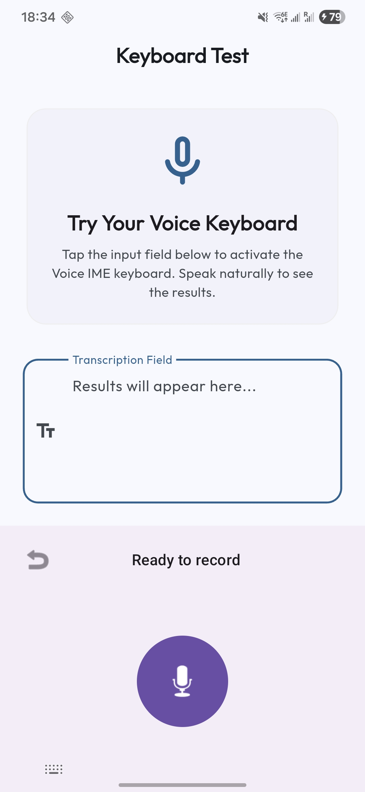
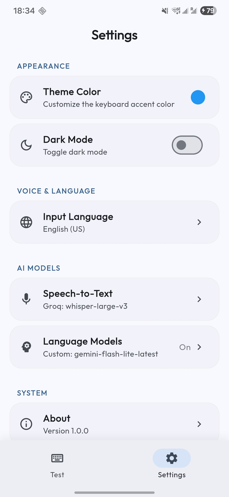
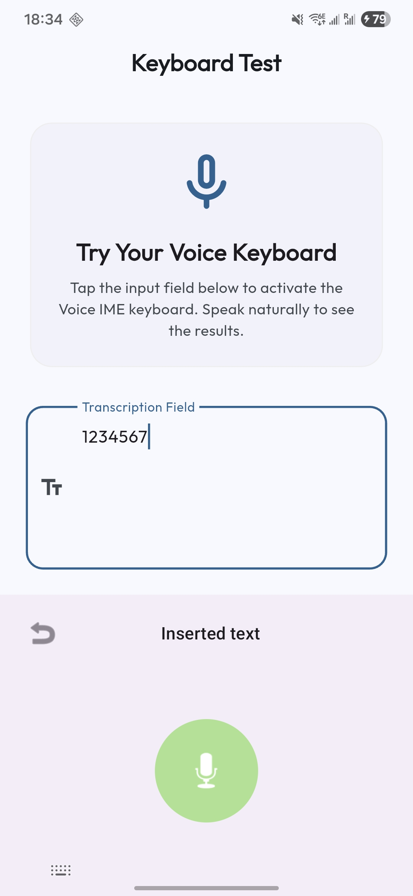

  

# Hashtype 🎙️

[English](README.md) | [简体中文](README_zh.md)

**Hashtype** is an open-source Android Voice Typing Keyboard (IME) designed for users who want complete control over their speech-to-text (STT) pipeline.

Unlike standard keyboards that lock you into a single provider, Hashtype allows you to bring your own API endpoints and layer Large Language Models (LLMs) on top of your transcripts for perfect, context-aware results. System prompts for cleaning the text is also customizable, as well as the endpoint.

---

## 🚀 Setup & Usage

1. **Download & Install:**
   - Download the latest APK from the [Releases](https://github.com/blakejjia/speech-to-text-board-android/releases) page and install it on your Android device.
2. **Configure Providers:**
   - Open the **Hashtype** app from your launcher.
   - Go to **STT Settings** and enter your endpoint and API key (e.g., OpenAI Whisper).
   - Go to **LLM Settings**, enable "AI Cleaning", and set your system prompt (optional but recommended).
3. **Enable Keyboard:**
   - Go to Android Settings > Languages & Input > On-screen keyboard > Manage keyboards.
   - Turn on **Hashtype**.
4. **Start Typing:**
   - In any app, switch your input method to **Hashtype**.
   - Tap the microphone icon to start recording, speak, and tap again to transcribe and insert text.

---

## 📸 Screenshots

|             Keyboard Ready             |                   Settings                   |                       STT Config                       |
| :------------------------------------: | :------------------------------------------: | :----------------------------------------------------: |
|  |  |  |

|                             LLM Config                              |                 Final Result                 |
| :-----------------------------------------------------------------: | :------------------------------------------: |
|  |  |

---

## 🌟 Key Features

- **Open Source:** Completely transparent and free to use. Host your own backends or use your favorite providers.
- **Custom API Endpoints:**
  - **Speech-to-Text:** Support for OpenAI-compatible transcription APIs (like Whisper).
  - **Large Language Models:** Support for OpenAI, Anthropic, and Google Gemini.
- **AI Cleaning Pipeline:** Automatically send your STT transcript to an LLM to fix grammar, punctuation, and context errors before it's even typed.
- **Customizable System Prompts:** Tailor exactly how the AI "cleans" your text. Want it to translate? Summarize? Formalize? Just change the system prompt.
- **Minimal Permissions, Maximum Privacy:** Hashtype **does not require** any dangerous system accessibility permissions or extra system-level control. Unlike many other AI input tools that request accessibility access to function, Hashtype only needs microphone access to record your voice. This ensures your screen content, passwords, and sensitive data remain private and your device stays secure.
- **Direct Communication:** No intermediate servers. The app communicates directly with your specified API endpoints.
- **Material 3 Design:** A modern, clean keyboard interface that supports dynamic colors and looks great on Android.

---

## 🛠️ How it Works

1. **Record:** Tap the mic and speak. The keyboard records high-quality audio.
2. **Transcribe:** Audio is sent to your chosen **STT Provider** (e.g., Whisper).
3. **Refine (Optional):** The transcript is sent to your chosen **LLM Provider** (e.g., GPT-4o, Claude 3.5 Sonnet, Gemini 1.5 Pro).
4. **Clean:** The LLM follows your **Custom System Prompt** to polish the text (remove "uhm/ah", fix typos, apply formatting).
5. **Input:** The final, perfect text is committed directly into the text field.

---

## 🏗️ Architecture

- **`apps/flutter_app`**: The main configuration app and the bridge for settings.
- **`apps/flutter_app/android`**: Contains the native Kotlin `InputMethodService` implementation for high-performance voice recording and IME integration.
- **`services/`**: Shared logic for API communication and provider management.

---

## 🤝 Contributing

We welcome contributions! Whether it's improving the UI, or fixing bugs, feel free to open a PR or an issue.

## 📄 License

This project is licensed under the [GPL v3 License](LICENSE).

---

Made with ❤️ for the open-source community.
