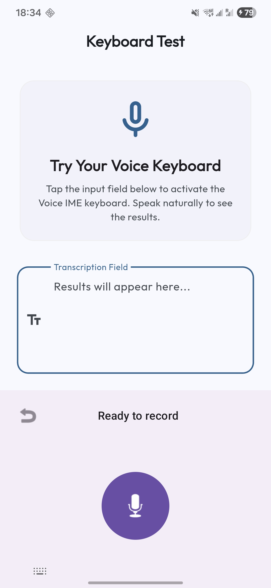
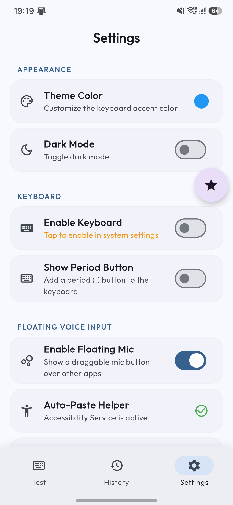
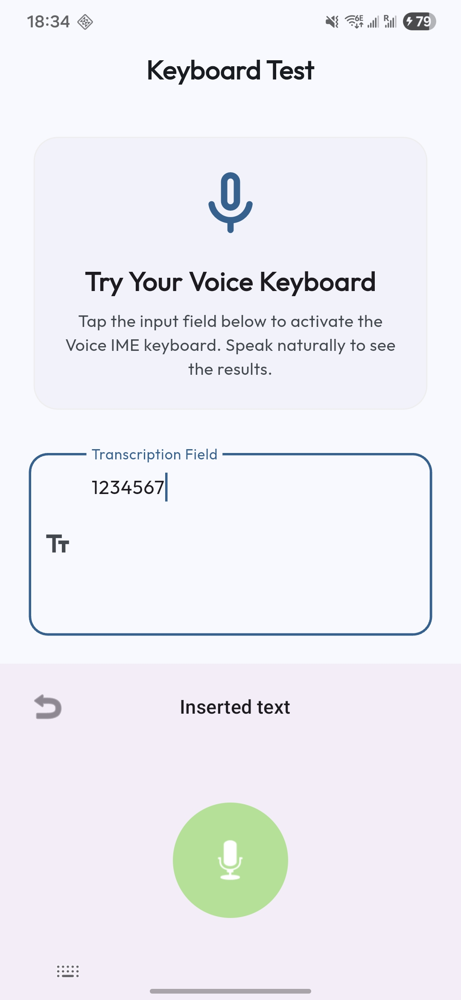
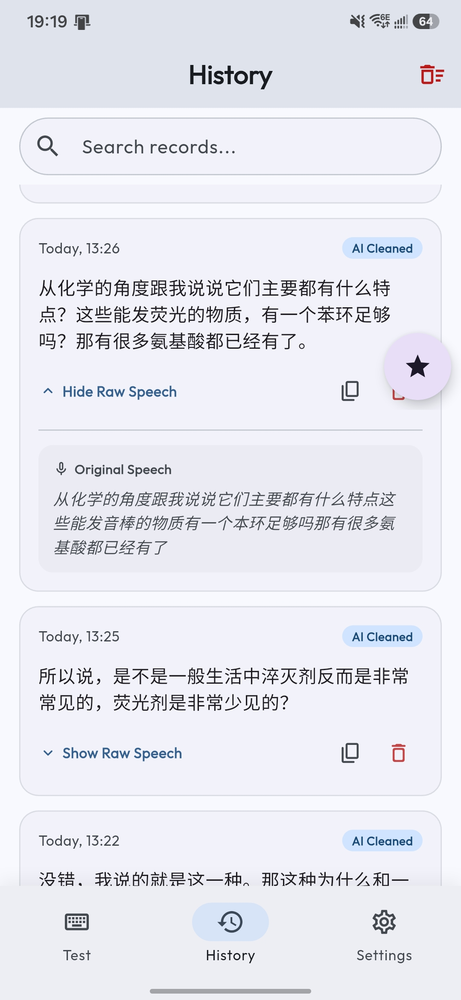
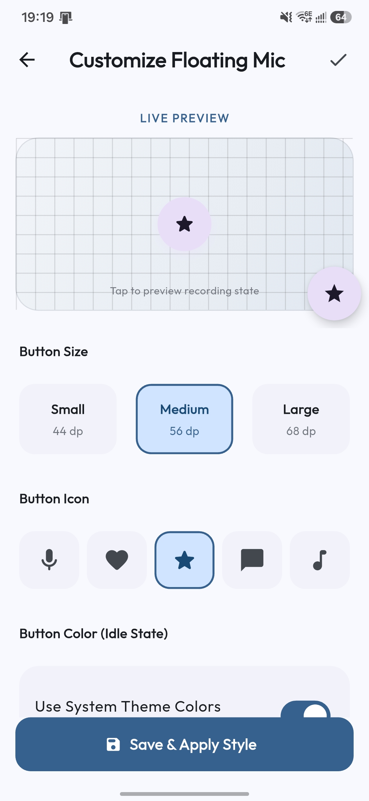
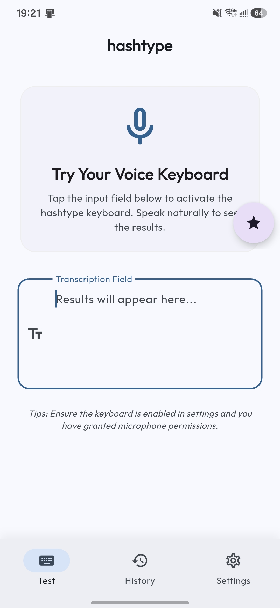
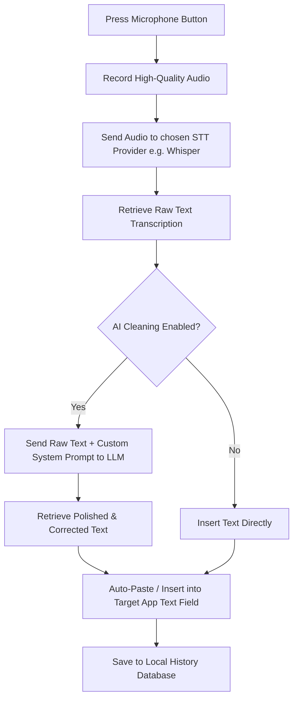

<p align="center">
  
</p>

# Hushtype 🎙️🤖

[English](README.md) | [简体中文](README_zh.md)

**Hashtype** is a state-of-the-art, open-source Android Voice-Typing Keyboard (IME) and Companion App. It is designed specifically for users who want complete control over their speech-to-text (STT) pipeline and data privacy. 

Unlike traditional voice-typing keyboards that lock you into a single corporate service, Hashtype lets you bring your own API keys for **Speech-to-Text (STT)** and overlay **Large Language Models (LLMs)** to proofread, format, and polish your voice transcriptions in real time before they are entered.

---

## 📸 App Screenshots

### Core Keyboard & Setup Experience

| ⌨️ Active IME Keyboard | ⚙️ Settings Dashboard | 🎙️ Speech-To-Text Config |
| :---: | :---: | :---: |
|  |  |  |

### AI Integration & History Logs

| 🤖 Language Model Config | 📝 Text Insertion Result | 📜 History & AI Diffs |
| :---: | :---: | :---: |
|  |  |  |

### Floating Voice Input Widget

| 🫧 Floating Mic Customizer | 💬 Floating Mic In-App Overlay |
| :---: | :---: |
|  |  |

---

## 🚀 Key Features

*   **🎙️ Bring Your Own API (STT):** Connects directly to any OpenAI Whisper-compatible endpoints, Groq, Mistral, or your own self-hosted Whisper instance.
*   **🤖 AI-Powered Cleaning (LLM):** Automatically route transcriptions through an LLM (OpenAI GPT-4o, Anthropic Claude, or Google Gemini) to eliminate verbal stumbles ("umms", "ahhs"), correct grammar, and inject proper punctuation.
*   **✍️ Customizable System Prompts:** Take control of your AI's writing style. Configure the system prompt to automatically translate your spoken words, write code, format text as markdown, or convert your speech into formal business English.
*   **🫧 Draggable Floating Mic Widget:** Voice-type *anywhere* in Android without switching your active keyboard! Toggle a customizable overlay floating microphone button that floats above other apps.
*   **📋 Smart Auto-Paste Helper:** When using the Floating Mic, an optional accessibility helper automatically pastes the finished, polished text straight into the active cursor field.
*   **📜 Local Transcription History:** View and search a secure local history of your transcriptions. Compare the **Original Speech** transcription side-by-side with the **AI Cleaned** text using expandable diff cards.
*   **🎨 Dynamic Material 3 Design:** Fully customizable keyboard accent colors, dark/light mode toggle, and a clean modern aesthetic that adapts to your Android device.
*   **🔒 Privacy-First Architecture:** 
    *   No middleman servers: The app communicates directly from your device to your configured APIs.
    *   No keyboard accessibility logging: Unlike other third-party keyboard apps, Hashtype **does not** require invasive accessibility permissions to log keystrokes. It only requests the Microphone permission for voice recording, and standard Overlay permissions *if* you use the floating mic.

---

## 🏗️ How It Works (Transcription Pipeline)


```mermaid
graph TD
    A[Press Microphone Button] --> B[Record High-Quality Audio]
    B --> C[Send Audio to chosen STT Provider e.g. Whisper]
    C --> D[Retrieve Raw Text Transcription]
    D --> E{AI Cleaning Enabled?}
    E -- Yes --> F[Send Raw Text + Custom System Prompt to LLM]
    F --> G[Retrieve Polished & Corrected Text]
    E -- No --> H[Insert Text Directly]
    G --> I[Auto-Paste / Insert into Target App Text Field]
    H --> I
    I --> J[Save to Local History Database]
```


---

## ⚙️ Supported Providers

| Provider | Speech-to-Text (STT) | Language Models (LLM) | Connection Method |
| :---: | :---: | :---: | :---: |
| **OpenAI** | ✅ (Whisper-1) | ✅ (GPT-4o, GPT-3.5, etc.) | Official API |
| **Google Gemini** | ❌ | ✅ (Gemini 1.5 Pro/Flash) | Official API |
| **Groq** | ✅ (Whisper Large V3) | ✅ (Llama 3, Mixtral, etc.) | Official API |
| **Custom Endpoint**| ✅ (OpenAI API Compatible) | ✅ (OpenAI API Compatible) | Self-hosted or third-party gateways |

---

## 🛠️ Installation & Activation

### Step 1: Install the APK
*   Download the latest release APK from the [Releases](https://github.com/blakejjia/speech-to-text-board-android/releases) page and install it on your Android device.

### Step 2: Configure API Keys
1.  Open the **Hashtype** app from your launcher.
2.  Go to **Speech-to-Text**, choose your provider (e.g., OpenAI or Groq), enter your API Key, and fetch/select your preferred transcription model.
3.  Go to **Language Models**, turn on "AI Cleaning", choose your LLM provider, enter your API key, and select a model.
4.  *(Optional)* Edit the **System Prompt** to define exactly how you want your text edited or formatted.

### Step 3: Enable the Input Method
1.  Go to Android **Settings** > **System** > **Languages & Input** > **On-screen Keyboard** > **Manage Keyboards**.
2.  Enable **Hashtype**.
3.  Open any text field, swipe down or tap the keyboard selection menu, and switch to **Hashtype Keyboard**.

---

## 💡 System Prompt Customization Examples

The power of Hashtype lies in its prompt flexibility. Here are some system prompts you can copy and paste into the LLM Settings:

### 1. Default Grammar & Punctuation Clean Up
> "You are an assistant that formats spoken audio transcriptions. Fix spelling, capitalization, punctuation, grammar, and remove verbal fillers ('uh', 'um', 'like'). Do not add any conversational responses; output only the corrected transcript."

### 2. Auto-Translator (Speak Chinese ➡️ Input English)
> "Translate the following transcribed text from Chinese to natural, idiomatic English. Only return the final English translation. Do not explain, discuss, or prefix the translation."

### 3. Markdown Formatter
> "Format the transcribed text using appropriate Markdown syntax. Organize lists, bold key concepts, and structure paragraphs correctly. Return only the Markdown text."

---

## 🧱 Project Architecture

Hashtype is built using a **Dual Dart (Flutter) + Native Kotlin** architecture. This separates configuration and high-performance background keyboard integrations.

```
├── android/app/src/main/kotlin/com/jia_yx/hashtype/
│   ├── MainActivity.kt                 # Flutter MethodChannel bridge
│   ├── VoiceInputMethodService.kt      # Native IME Keyboard Service
│   ├── VoiceImeViewModel.kt            # Handles recording audio, API pipelines
│   ├── VoiceImeView.kt                 # Native Material 3 Keyboard UI layout
│   ├── ImeSettingsResolver.kt          # Kotlin-side SharedPrefs JSON parser
│   └── HashtypeRecognitionService.kt    # Android RecognitionService binding
└── lib/                                # Flutter Configuration Application
    ├── main.dart                       # App entry point
    ├── pages/                          # Pages for Test, History, Settings
    └── services/                       # Providers & settings service managers
```

### Why Dual Implementations?
The Kotlin `InputMethodService` manages recording and API calls natively. This ensures the keyboard launches instantly when tapping a text field, without waiting for a heavy Flutter engine to spin up. Both layers read configuration directly from the shared `FlutterSharedPreferences` file, keeping your configurations in sync seamlessly.

---

## 🧑‍💻 Development & Build Setup

To compile the application yourself, make sure you have the Flutter SDK and Android SDK installed.

### Build Commands (Repo Root)

1.  **Install dependencies:**
    ```bash
    flutter pub get
    ```

2.  **Run static code analysis:**
    ```bash
    flutter analyze
    ```

3.  **Build a release APK:**
    Make sure you have a `key.properties` file configured at the `android/` directory root, then run:
    ```bash
    flutter build apk --release
    ```

4.  **Build Google Play App Bundle:**
    ```bash
    flutter build appbundle --release
    ```

---

## 🤝 Contributing

Contributions are always welcome! Feel free to open a Pull Request (PR) or submit an Issue if you encounter bugs, want to suggest new features, or can improve our UI/documentation.

## 📄 License

This project is licensed under the [GPL v3 License](LICENSE).

---
*Created with ❤️ for the open-source privacy-focused community.*
